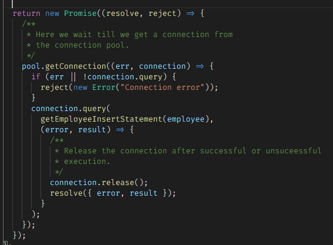

# Application using Distributed Database


Locally it runs upto 3 instances.

```bash
sh startScript.sh
```

To run the load test on the application

```bash
node loadTest.js
```

## TiDb configuration used for the application.

| Component | Count | Description |
| --- | --- | --- |
| TiDb Server | 2   | Database is responsible for holding all the data. Asynchronous replication is performed on all instances to keep the consistency. |
| Placement Driver | 3   | Placement drivers are responsible for holding metadata information for the running cluster. |
| TiKV | 3   | Key-value store used by the TiDb Server.  Row based storage of values. |
| TiFlash | 1   | Columnar storage of values. |

## The Application

Application is developed in Typescript  and its implemented with very basic `regions ` concept. Let's have a look through the major components of the application.

#### Database Config

Since our `TiDb` has 2 endpoints exposed we will use `localhost:4000` for `IND` and `EU` regions and for the `US` we will use `localhost:4001`


> Note ℹ Since the application is created for demonstration purposes we have hardcoded the backing service configs here. In production environments a seperate scaling service is used for this purpose.

#### Connection Pool

Since we are in javascript environment we have kept the connection pooling as `async` as possible.



##

### Measurements

We ran the application with multiple configuration. Here are some of the observations.

> Note ℹ Following measurements are taken on a machine with 2.7 GHz processor and 16 GB RAM. The actual production measurements are subject to change. Consider these observations at your own risk ⚠.

### Non-Scalar application with 1 Db 1 TiKV 1 TiFlash

```json
{
    "totalRequests": 5000,
    "totalErrors": 0,
    "totalTimeSeconds": 41.175269899999996,
    "rps": 121,
    "meanLatencyMs": 41,
    "maxLatencyMs": 337,
    "minLatencyMs": 9,
    "percentiles": {
        '50': 33,
        '90': 72,
        '95': 92,
        '99': 158
    },
    "errorCodes": {},
    "instanceIndex": 0
}
```

### Non-Scalar application with 2 Db 3 TiKv 1 TiFlash

```json
{
    "totalRequests": 5000,
    "totalErrors": 0,
    "totalTimeSeconds": 29.685227299999998,
    "rps": 168,
    "meanLatencyMs": 29.5,
    "maxLatencyMs": 124,
    "minLatencyMs": 8,
    "percentiles": {
        '50': 27,
        '90': 41,
        '95': 48,
        '99': 70
    },
    "errorCodes": {},
    "instanceIndex": 0
}
```

### Scalar application with 2 Db 3 TiKv 1 TiFlash

```json
{
    "totalRequests": 5000,
    "totalErrors": 0,
    "totalTimeSeconds": 20.3026847,
    "rps": 246,
    "meanLatencyMs": 40.4,
    "maxLatencyMs": 183,
    "minLatencyMs": 10,
    "percentiles": {
        '50': 37,
        '90': 57,
        '95': 68,
        '99': 116
    },
    "errorCodes": {},
    "instanceIndex": 0
}
```

## Auto-Scaling

Although autoscaling is documented in the `tidb` official documentation, we had a tough time configuring it in local. `Kubernetes` is used to automatically scale out the `TiDb` server.

[Official Documentation](https://docs.pingcap.com/tidb-in-kubernetes/dev/get-started) All the best 👍

## Conclusion

`TiDb` offers a nice learning opportunity for those who want to venture into the wilderness of distributed systems.

### The performance

Key aspects of the TiDb servers are horizontally scaled architecture and the load balancing components such as Linux Virtual Server (LVS), HAProxy, or F5.


276 Queries per second. ( not bad 👏)

Query execution time stays within the `50ms` benchmark. Queries per second reaches `276` mark.


## Usability

`TiDb` comes along with a nice package of monitors and performance visualizer tools.

### Dashboard


### Grafana


Apart from the auto-scaling problem we did not run into any hic-cups while making this project. Would recommend it `9/10`

## Contributors

| Name | GIT ID | BITS ID |
| --- | --- | --- |
| Roshan Gupta | [#GuptaRoshan](https://github.com/GuptaRoshan) | 2018HS70003 |
| Abhishek Sharma | [#abhish3k-sh](https://github.com/abhish3k-sh) | 2018HS70042 |
| Digvijay Wadkar | [#DigVijayWa](https://github.com/DigVijayWa) | 2018HS70036 |
| Mihir Sagar | [#mihirpsagar](https://github.com/mihirpsagar) | 2018HS70005 |

## References

- [TiDb documentation](https://docs.pingcap.com/tidb/stable/overview)