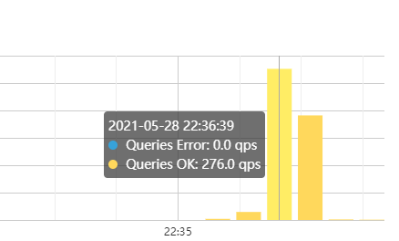
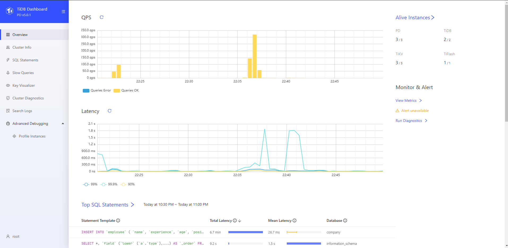
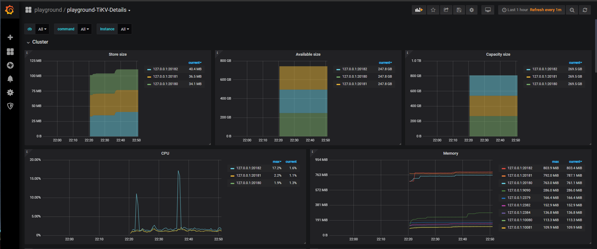

# Application using Distributed Database


Locally it runs upto 3 instances.

```bash
sh startScript.sh
```

To run the load test on the application

```bash
node loadTest.js
```
## What is TiDB
 - TiDB is a distributed SQL database platform that features horizontal scalability, strong consistency, and high availability. 
- The goal of TiDB is to serve as a one-stop solution for all online transactions and analysis so you can build your applications just as simply as on a single node.

## Key features: 

- ### <b> Horizontally scaling out or scaling in easily </b>

    The TiDB architecture design of separating computing from storage enables you to separately scale out or scale in the computing or storage capacity online as needed. The scaling process is transparent to application operations and maintenance staff.

- ### <b> Financial-grade high availability </b>

    The data is stored in multiple replicas. Data replicas obtain the transaction log using the Multi-Raft protocol. A transaction can be committed only when data has been successfully written into the majority of replicas. This can guarantee strong consistency, and availability when a minority of replicas go down. To meet the requirements of different disaster tolerance levels, you can configure the geographic location and number of replicas as needed.

- ### <b> Real-time HTAP </b>

    TiDB provides two storage engines: TiKV, a row-based storage engine, and TiFlash, a columnar storage engine. TiFlash uses the Multi-Raft Learner protocol to replicate data from TiKV in real time, ensuring that the data between the TiKV row-based storage engine and the TiFlash columnar storage engine are consistent. TiKV and TiFlash can be deployed on different machines as needed to solve the problem of HTAP resource isolation.

- ### <b> Cloud-native distributed database </b>

    TiDB is a distributed database designed for the cloud, providing flexible scalability, reliability and security on the cloud platform. Users can elastically scale TiDB to meet the requirements of their changing workloads. TiDB Operator helps manage TiDB on Kubernetes and automates tasks related to operating the TiDB cluster, which makes TiDB easier to deploy on any cloud that provides managed Kubernetes. TiDB Cloud (Beta), the fully-managed TiDB service, is the easiest, most economical, and most resilient way to unlock the full power of TiDB in the cloud, allowing you to deploy and run TiDB clusters with just a few clicks.

- ### <b> Compatible with the MySQL 5.7 protocol and MySQL ecosystem </b>

    TiDB is compatible with the MySQL 5.7 protocol, common features of MySQL, and the MySQL ecosystem. To migrate your applications to TiDB, you do not need to change a single line of code in many cases or only need to modify a small amount of code. In addition, TiDB provides a series of data migration tools to help migrate application data easily into TiDB.

## Architecture: 

### <b> TiDB server </b>
The TiDB server is a stateless SQL layer that exposes the connection endpoint of the MySQL protocol to the outside. The TiDB server receives SQL requests, performs SQL parsing and optimization, and ultimately generates a distributed execution plan. It is horizontally scalable and provides the unified interface to the outside through the load balancing components such as Linux Virtual Server (LVS), HAProxy, or F5. It does not store data and is only for computing and SQL analyzing, transmitting actual data read request to TiKV nodes (or TiFlash nodes).

### <b> Placement Driver (PD) server </b>
The PD server is the metadata managing component of the entire cluster. It stores metadata of real-time data distribution of every single TiKV node and the topology structure of the entire TiDB cluster, provides the TiDB Dashboard management UI, and allocates transaction IDs to distributed transactions. The PD server is "the brain" of the entire TiDB cluster because it not only stores metadata of the cluster, but also sends data scheduling command to specific TiKV nodes according to the data distribution state reported by TiKV nodes in real time. In addition, the PD server consists of three nodes at least and has high availability. It is recommended to deploy an odd number of PD nodes.

### <b> Storage servers </b>
### <b> TiKV server </b>
The TiKV server is responsible for storing data. TiKV is a distributed transactional key-value storage engine. Region is the basic unit to store data. Each Region stores the data for a particular Key Range which is a left-closed and right-open interval from StartKey to EndKey. Multiple Regions exist in each TiKV node. TiKV APIs provide native support to distributed transactions at the key-value pair level and supports the Snapshot Isolation level isolation by default. This is the core of how TiDB supports distributed transactions at the SQL level. After processing SQL statements, the TiDB server converts the SQL execution plan to an actual call to the TiKV API. Therefore, data is stored in TiKV. All the data in TiKV is automatically maintained in multiple replicas (three replicas by default), so TiKV has native high availability and supports automatic failover.

### <b> TiFlash server </b>
The TiFlash Server is a special type of storage server. Unlike ordinary TiKV nodes, TiFlash stores data by column, mainly designed to accelerate analytical processing.

## TiDB configuration used for the application.

| Component | Count | Description |
| --- | --- | --- |
| TiDb Server | 2   | Database is responsible for holding all the data. Asynchronous replication is performed on all instances to keep the consistency. |
| Placement Driver | 3   | Placement drivers are responsible for holding metadata information for the running cluster. |
| TiKV | 3   | Key-value store used by the TiDb Server.  Row based storage of values. |
| TiFlash | 1   | Columnar storage of values. |

## The Application

Application is developed in Typescript  and its implemented with very basic `regions ` concept. Let's have a look through the major components of the application.

#### Database Config

Since our `TiDb` has 2 endpoints exposed we will use `localhost:4000` for `IND` and `EU` regions and for the `US` we will use `localhost:4001`


> Note ℹ Since the application is created for demonstration purposes we have hardcoded the backing service configs here. In production environments a seperate scaling service is used for this purpose.

#### Connection Pool

Since we are in javascript environment we have kept the connection pooling as `async` as possible.


##

### Measurements

We ran the application with multiple configuration. Here are some of the observations.

> Note ℹ Following measurements are taken on a machine with 2.7 GHz processor and 16 GB RAM. The actual production measurements are subject to change. Consider these observations at your own risk ⚠.

### Non-Scalar application with 1 Db 1 TiKV 1 TiFlash

```json
{
    "totalRequests": 5000,
    "totalErrors": 0,
    "totalTimeSeconds": 41.175269899999996,
    "rps": 121,
    "meanLatencyMs": 41,
    "maxLatencyMs": 337,
    "minLatencyMs": 9,
    "percentiles": {
        "50": 33,
        "90": 72,
        "95": 92,
        "99": 158
    },
    "errorCodes": {},
    "instanceIndex": 0
}
```

### Non-Scalar application with 2 Db 3 TiKv 1 TiFlash

```json
{
    "totalRequests": 5000,
    "totalErrors": 0,
    "totalTimeSeconds": 29.685227299999998,
    "rps": 168,
    "meanLatencyMs": 29.5,
    "maxLatencyMs": 124,
    "minLatencyMs": 8,
    "percentiles": {
        "50": 27,
        "90": 41,
        "95": 48,
        "99": 70
    },
    "errorCodes": {},
    "instanceIndex": 0
}
```

### Scalar application with 2 Db 3 TiKv 1 TiFlash

```json
{
    "totalRequests": 5000,
    "totalErrors": 0,
    "totalTimeSeconds": 20.3026847,
    "rps": 246,
    "meanLatencyMs": 40.4,
    "maxLatencyMs": 183,
    "minLatencyMs": 10,
    "percentiles": {
        "50": 37,
        "90": 57,
        "95": 68,
        "99": 116
    },
    "errorCodes": {},
    "instanceIndex": 0
}
```

## Auto-Scaling

Although autoscaling is documented in the `tidb` official documentation, we had a tough time configuring it in local. `Kubernetes` is used to automatically scale out the `TiDb` server.

[Official Documentation](https://docs.pingcap.com/tidb-in-kubernetes/dev/get-started) All the best 👍

## Conclusion

`TiDb` offers a nice learning opportunity for those who want to venture into the wilderness of distributed systems.

### The performance

Key aspects of the TiDb servers are horizontally scaled architecture and the load balancing components such as Linux Virtual Server (LVS), HAProxy, or F5.



276 Queries per second. ( not bad 👏)

Query execution time stays within the `50ms` benchmark. Queries per second reaches `276` mark.


## Usability

`TiDb` comes along with a nice package of monitors and performance visualizer tools.

### Dashboard



### Grafana



Apart from the auto-scaling problem we did not run into any hic-cups while making this project. Would recommend it `9/10`

## Contributors

| Name | GIT ID | BITS ID |
| --- | --- | --- |
| Roshan Gupta | [#GuptaRoshan](https://github.com/GuptaRoshan) | 2018HS70003 |
| Abhishek Sharma | [#abhish3k-sh](https://github.com/abhish3k-sh) | 2018HS70042 |
| Digvijay Wadkar | [#DigVijayWa](https://github.com/DigVijayWa) | 2018HS70036 |
| Mihir Sagar | [#mihirpsagar](https://github.com/mihirpsagar) | 2018HS70005 |

## References

- [TiDb documentation](https://docs.pingcap.com/tidb/stable/overview)